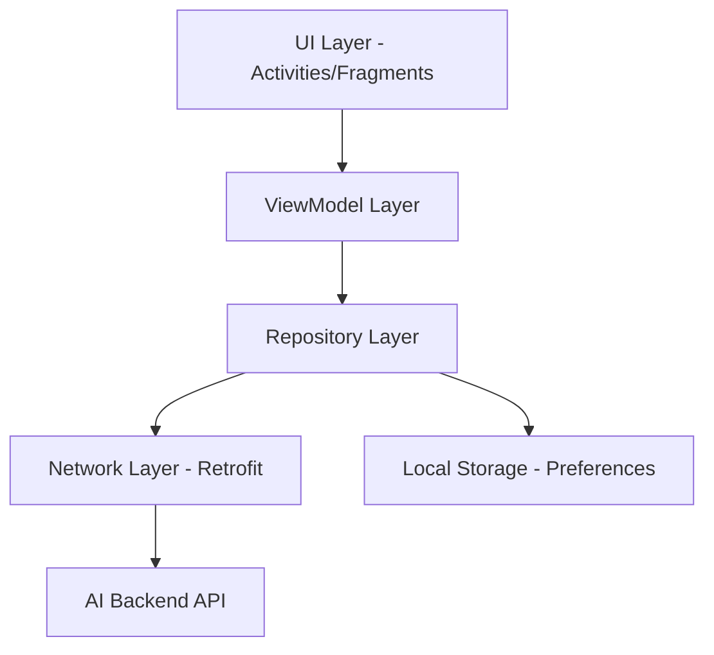

# 📱 ResolveIQ: AI-Powered Enterprise Helpdesk

[](https://kotlinlang.org/)
[](https://developer.android.com/)
[](https://m3.material.io/)
[](https://github.com/Anil3737/ResolveIQ_frontend)

**ResolveIQ** is a state-of-the-art enterprise helpdesk solution that leverages Artificial Intelligence to revolutionize internal support workflows. Designed for modern corporate environments, it provides a seamless, high-performance mobile experience for employees and support staff alike.

---

## ✨ Pro-Level Features & AI Intelligence

ResolveIQ isn't just a ticketing system; it's an intelligent orchestration layer for your enterprise.

### 🧠 AI-Driven Risk Analysis
Every ticket is automatically analyzed by our backend AI engine to determine its **Risk Score (0-100)**.
- **Dynamic Risk Badging**: Tickets are visually flagged (Low, Medium, High, Critical) based on AI assessment.
- **Escalation Prediction**: The system identifies high-risk tickets before they breach SLA.
- **Sentiment & Priority**: Uses advanced NLP to gauge the urgency and impact of issues.

### ⏳ Precision SLA Monitoring
- **Real-time Countdowns**: Active timers on every ticket showing time remaining until breach.
- **Automated Escalations**: Tickets automatically move through the hierarchy if not addressed within the SLA window.
- **Breach Alerts**: Visual high-contrast indicators for tickets that have exceeded their time limits.

### 👥 Sophisticated Role-Based Ecosystem
Four distinct, tailored experiences optimized for specific workflows:
- **Admin**: Strategic oversight with cross-department analytics, staff management, and system-wide risk monitoring.
- **Team Lead**: Tactical management with ticket assignment, workload balancing, and approval pools.
- **Support Agent**: High-efficiency queue management, one-click ticket acceptance, and resolution tracking.
- **Employee**: Conversational ticket creation, real-time status tracking, and risk insight visibility.

---

## 🎨 Premium UI/UX & Motion Design

Experience a "Wired-to-Wireless" feel with our modern design language.

### 🎭 Animation Engine
We've implemented custom animations to make the interface feel alive:
- **Splash Sequence**: A smooth, professional `fade_in` animation for the logo paired with a high-fidelity loading progress interceptor.
- **Smooth Transitions**: Activity transitions are optimized for low latency and high fluidness.
- **Micro-interactions**: Subtle tactile feedback and visual states for every button and card interaction.

### 🏢 Material 3 Excellence
- **Edge-to-Edge Design**: Full utilization of modern screen real estate.
- **Dynamic Color Mapping**: Status colors change based on ticket risk and SLA health.
- **Enterprise Dark Mode**: A meticulously tuned dark theme optimized for long-hour support shifts.
- **Clean Card-based UI**: Hierarchical information display that prevents cognitive overload.

---

## 🏗 Industrial-Grade Architecture

Built on a foundation of reliability and scalability.



- **MVVM Pattern**: Strict separation of concerns for maintainability.
- **Clean Architecture Principles**: Business logic isolated in the Repository layer.
- **Coroutines & Flow**: Asynchronous programming for a stutter-free UI.
- **Retrofit & OkHttp**: Secure, robust API communication with 401 token interceptors.
- **ViewBinding**: Type-safe layout interactions.

---

## 🛠 Tech Stack

| Category | Technology |
| :--- | :--- |
| **Language** | Kotlin |
| **UI Framework**| Material 3 (M3) |
| **Networking**  | Retrofit 2, OkHttp |
| **Serialization**| GSON |
| **Concurrency** | Kotlin Coroutines |
| **Jetpack**     | ViewBinding, ViewModel, LiveData |
| **Persistence** | Shared Preferences (Secure Token Storage) |

---

## 🚀 Getting Started

### Prerequisites
- Android Studio Iguana or newer
- Android SDK 34 (UpsideDownCake)
- ResolveIQ Backend (running locally or on server)

### Installation
1. **Clone the repository:**
   ```bash
   git clone https://github.com/Anil3737/ResolveIQ_frontend.git
   ```
2. **Open in Android Studio:**
   Import the project and let Gradle sync.
3. **Configure API Endpoint:**
   Navigate to `app/src/main/java/com/simats/resolveiq_frontend/network/RetrofitClient.kt` and update the `BASE_URL`:
   ```kotlin
   val BASE_URL = "http://YOUR_LOCAL_IP:5000/api/"
   ```
4. **Build & Run:**
   Select your device/emulator and press **Run**.

---

## 👨‍💻 Developed By

**Jada Chiranjevi Anil**  
*Computer Science & Engineering*  
**SIMATS ENGINEERING**


---

